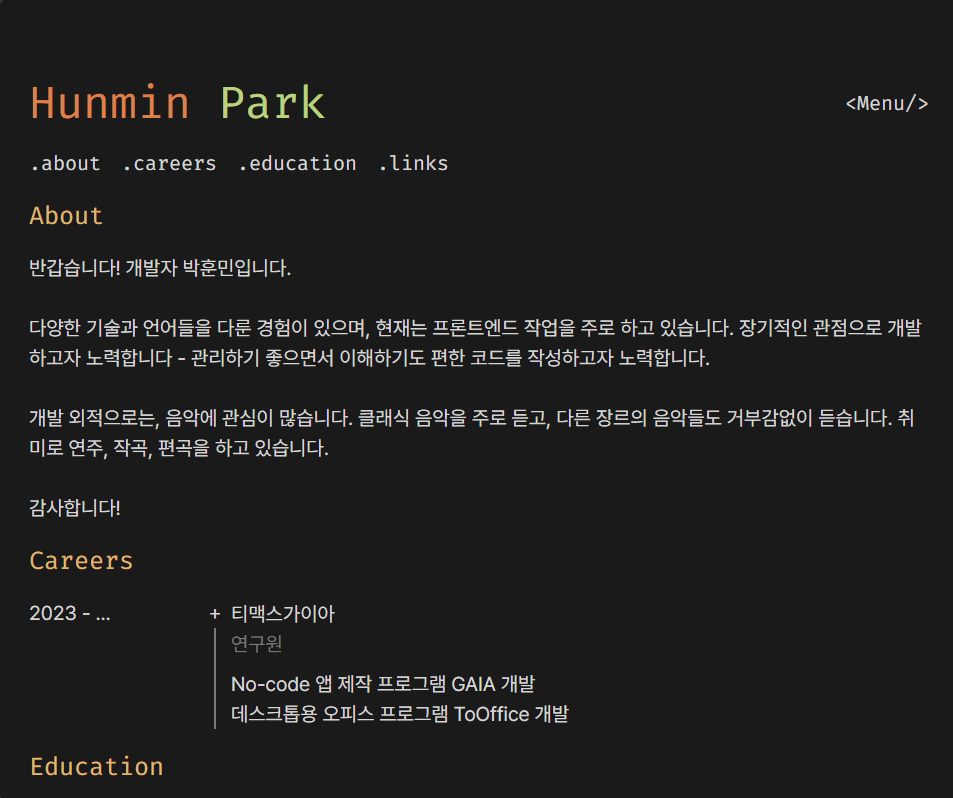

# mypage

Old versions

<h4><a target="_blank" href="https://github.com/Avantgarde95/Avantgarde95.github.io/tree/v2">V2</a></h4>

<h4><a target="_blank" href="https://github.com/Avantgarde95/Avantgarde95.github.io/tree/v1">V1</a></h4>

## How to run

Must install

- [Node.js](https://nodejs.org/)

Recommended to install

- [React devtools](https://chrome.google.com/webstore/detail/react-developer-tools/fmkadmapgofadopljbjfkapdkoienihi?hl=ko)
- [VSCode Prettier extension](https://marketplace.visualstudio.com/items?itemName=esbenp.prettier-vscode)

Install the dependencies

- Run `yarn`

Run in the development mode

- Run `yarn dev`
- Open <http://localhost:3000> on the browser
- To use other ports, use `-p`. (ex. `yarn dev -p 4000`)

Build in the production mode & create static pages

- Run `yarn build`

Check the code

- Run `yarn lint`
- Run `yarn lint:fix` to check & fix
